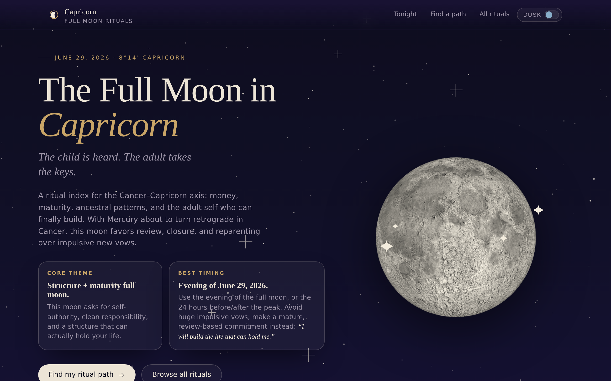
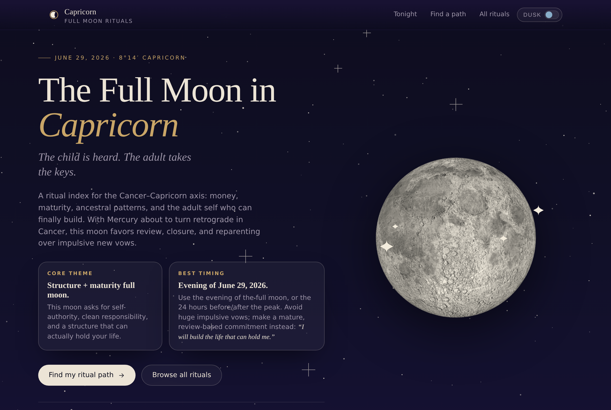
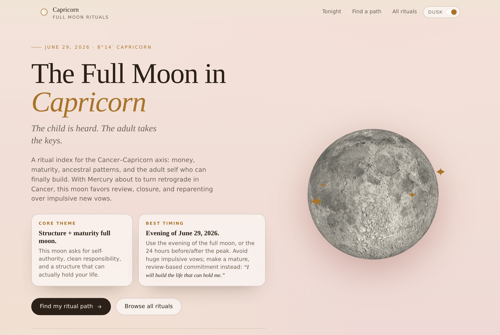
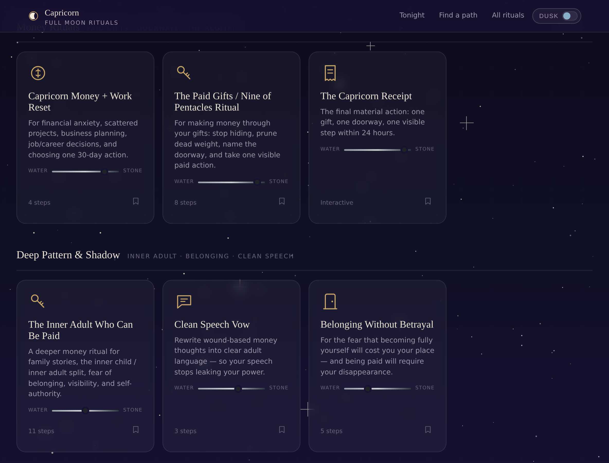
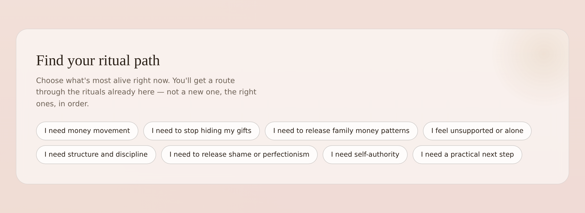
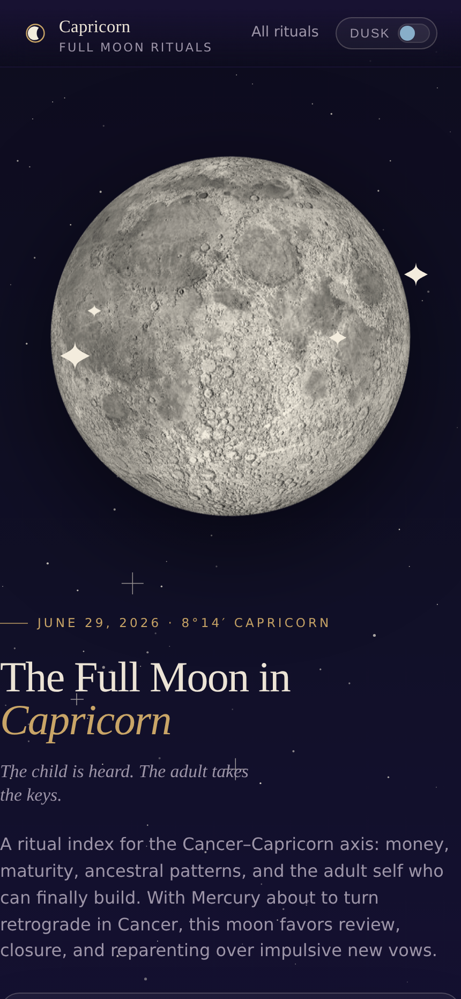

<!-- ─────────────────────────────────────────────────────────────
     MOON RITUAL ATLAS · a field guide to the lunar year
     The hero below is a real capture of the live site.
     ───────────────────────────────────────────────────────────── -->

<p align="center">
  <a href="https://moon-ritual-atlas.vercel.app/" title="Open Moon Ritual Atlas — live">
    
  </a>
</p>

<p align="center">
  <em>Figure I.</em> &nbsp;The first live room of the atlas — <strong>The Full Moon in Capricorn</strong>. &nbsp;<sub>Tap the image to enter →</sub>
</p>

<p align="center">
  <a href="https://moon-ritual-atlas.vercel.app/">
    
  </a>
  &nbsp;
  
  &nbsp;
  
  &nbsp;
  
</p>

<h1 align="center">Moon Ritual Atlas</h1>

<p align="center">
  <strong>A future-facing field guide to the lunar year.</strong><br>
  Full moons · new moons · eclipses · seasonal thresholds — each one a guided ritual room.
</p>

---

## ☾ &nbsp; The atlas

Moon Ritual Atlas is being built as a **consumer-facing ritual experience**: a mobile-first place to walk into the lunar cycle through guided rituals, symbolic tools, reflective prompts, visually rich ritual pages, and one grounded closing action that pulls the ritual into real life.

It is an *atlas*, not a blog and not a single page. The lunar year has fifty-odd doorways — full moons, new moons, eclipses, solstices, equinoxes — and each one deserves its own room: a ritual index, a path finder, notecard-style steps you can move through with your thumb, reflective tools, and a **material action** that proves the ritual happened.

The first room is open. The rest of the building is drawn.

> **The house style:** a modern spiritual product with the bones of a 19th-century field manual — small caps, figure labels, object plates, engraving-feel icons, and quiet marginalia — kept alive and uncluttered, materially grounded, never twee.

<p align="center">
  <a href="https://moon-ritual-atlas.vercel.app/"><strong>⟶ &nbsp; Enter the live atlas &nbsp; ⟵</strong></a><br>
  <code>https://moon-ritual-atlas.vercel.app/</code>
</p>

> ☾ &nbsp;**Moon Ritual Atlas is live now.** Best on your phone — open it on the evening of a full moon and walk straight in.

---

## ✦ &nbsp; What Moon Ritual Atlas is becoming

The atlas is built to expand. Today it holds one moon; the structure is the same for every moon that follows.

| Plate | Coming room | What it holds |
|:---:|:---|:---|
| ☾ | **Full moon indexes** | A guided ritual index for every full moon, by zodiac sign |
| ● | **New moon intentions** | Intention-setting rituals by sign and theme |
| ◐ | **Eclipses & thresholds** | Heavier rituals for the year's astrological portals |
| ❂ | **Seasonal rituals** | Collections tied to solstices, equinoxes, and turning points |
| ⟿ | **Ritual paths** | A finder that routes you through the *right* rituals, in order |
| ✎ | **Saved reflections** | Writing, copying, exporting, and keeping your ritual notes |
| ▭ | **Ritual receipts** | The material proof: one gift, one doorway, one visible step |
| ❖ | **The visual system** | Collage layers, antique object plates, moon fragments, marginalia |

The direction is **modern, alive, elegant, and practical** — mystical without clutter, grounded without going dry.

### Dawn & Dusk — not light & dark

Two modes carry two moods. **Dusk** is moonlit and water-cool; **Dawn** is warm rose and lifting. They are atmospheres, not a toggle.

<p align="center">
  <a href="https://moon-ritual-atlas.vercel.app/">
    
    
  </a>
</p>
<p align="center">
  <em>Figure II.</em> &nbsp;<strong>Dusk</strong> (left) and <strong>Dawn</strong> (right) — the same room, two times of day.
</p>

---

## ◐ &nbsp; Featured now — The Full Moon in Capricorn

The first live room of the atlas is the **Full Moon in Capricorn Ritual Index**. It is not the whole project — it is the proof of the form, the model room every future moon is built against.

It is a ritual index for the **Cancer–Capricorn axis**, organized around:

> **money** · **maturity** · **self-authority** · **ancestral patterns** · **structure** · *the adult self who can finally build*

**Walk into it here → &nbsp; <https://moon-ritual-atlas.vercel.app/>**

<p align="center">
  <a href="https://moon-ritual-atlas.vercel.app/">
    
  </a>
</p>
<p align="center">
  <em>Figure III.</em> &nbsp;The ritual index — each card an <strong>object plate</strong> (key, receipt, doorway, vow) with a <span title="materiality">water ↔ stone</span> materiality reading and a step count.
</p>

### What is live in the Capricorn room

- **Dawn / Dusk modes** — two atmospheres, not generic light/dark
- **Ritual Path Finder** — choose what's most alive and get a route through the rituals already here
- **Ritual index cards** — organized by theme, each with an antique icon plate
- **Guided notecard ritual pages** — tactile, focused, one step at a time
- **Swipe navigation** — move through ritual steps with your thumb
- **Copy / export / receipt flow** — carry the ritual out of the screen
- **Soft motion pass** — quiet movement on the main page and the cards
- **Mobile-friendly Vercel deployment** — built to live in your hand

<p align="center">
  <a href="https://moon-ritual-atlas.vercel.app/">
    
  </a>
</p>
<p align="center">
  <em>Figure IV.</em> &nbsp;<strong>Find your ritual path.</strong> &nbsp;Choose what's most alive; the atlas orders the right rituals for you.
</p>

---

## ❑ &nbsp; The Capricorn ritual inventory

Eleven rituals, grouped into four movements. Every title below is a live page.

### ⛰ Core Capricorn

| Ritual | What it works |
|:---|:---|
| **The Mountain Ritual** | Discipline, structure, long-term goals, and carrying the *right* burden |
| **Authority Release Ritual** | Shame, perfectionism, the inner critic, fear of judgment, authority wounds |
| **Full Moon Audit** | A practical review of what's sustainable, what needs structure, what to release |

### ◉ Money Rituals

| Ritual | What it works |
|:---|:---|
| **Capricorn Money + Work Reset** | Resource tracking, career clarity, one grounded 30-day action |
| **The Paid Gifts / Nine of Pentacles Ritual** | Making money through real gifts — visibility, paid form, structure |
| **The Capricorn Receipt** | The closing material action that proves the ritual entered reality |

### ☾ Deep Pattern / Shadow

| Ritual | What it works |
|:---|:---|
| **The Inner Adult Who Can Be Paid** | Family stories, self-authority, money, belonging, waiting to be rescued |
| **Clean Speech Vow** | Rewriting wound-based money thoughts into clear adult language |
| **Belonging Without Betrayal** | Becoming visible without losing yourself |

### ⚯ Ancestral / Family

| Ritual | What it works |
|:---|:---|
| **The Ancestral Backbone Ritual** | Keeping inherited strength while releasing inherited suffering |
| **Money Is No Longer Allowed to Mean…** | Releasing old meanings on money — survival, punishment, shame, abandonment |

<p align="center">
  <a href="https://moon-ritual-atlas.vercel.app/">
    
  </a>
</p>
<p align="center">
  <em>Figure V.</em> &nbsp;Built mobile-first — the atlas is made to live in your hand.
</p>

---

## ⟿ &nbsp; Roadmap

The path from *one room* to *the whole building*:

- [ ] **Addressable rituals** — hash-linked routes, e.g. `#ritual/paid-gifts`
- [ ] **localStorage persistence** — keep notes, bookmarks, mode, and receipt fields between visits
- [ ] **Accessibility polish** — focus trap, Escape-to-close, visible focus states, reduced-motion checks
- [ ] **The full Ritual Atlas visual layer** — collage, object plates, field-manual detail, ritual marginalia
- [ ] **Cancer ↔ Capricorn axis interaction** — a meaningful, moving relationship between the two poles
- [ ] **More moons** — expand from Capricorn into future full moons and new moons

---

## ✦ &nbsp; Object plates & motifs

The visual language the atlas draws from, room to room:

> ☾ moon · ⛰ mountain · 🜂 key · 🕯 candle · ◡ bowl of water · ◉ coin · ◆ stone · ⌂ doorway · ✋ hand · ▤ ledger page · ⚯ roots & ancestral line · ⚖ scale · ♑ goat-horn abstraction · ▭ ritual notecard · ▰ receipt / material action

Collage-feel, antique icon plates, engraving lines, 19th-century illustration detail, marginalia, figure labels — a modern spiritual product wearing the clothes of an old field manual.

---

<details>
<summary><strong>⚙︎ Technical notes</strong> &nbsp;— for builders only</summary>

<br>

This is currently a **static HTML prototype**. No build step is required.

```text
moon-ritual-atlas/
├── index.html          # the entire Capricorn experience
├── README.md           # this page
└── assets/
    └── readme/         # real site screenshots used above
        ├── hero-capricorn.png
        ├── mode-dusk.png
        ├── mode-dawn.png
        ├── ritual-index.png
        ├── path-finder.png
        └── mobile-dusk.png
```

**Deployment** — Vercel, static:

```text
Project          moon-ritual-atlas
Framework preset Other
Build command    (none)
Output directory root
Live URL         https://moon-ritual-atlas.vercel.app/
```

All README images are real captures of `index.html`, committed into `assets/readme/` so they render reliably inside GitHub.

</details>

---

<p align="center">
  <em>The core line</em><br><br>
  <strong>The child is heard.</strong><br>
  <strong>The adult takes the keys.</strong><br>
  <strong>The gift gets a doorway.</strong><br>
  <strong>The ritual becomes material.</strong>
</p>

<p align="center">
  <a href="https://moon-ritual-atlas.vercel.app/"><strong>☾ &nbsp; Enter Moon Ritual Atlas &nbsp; ☾</strong></a>
</p>
