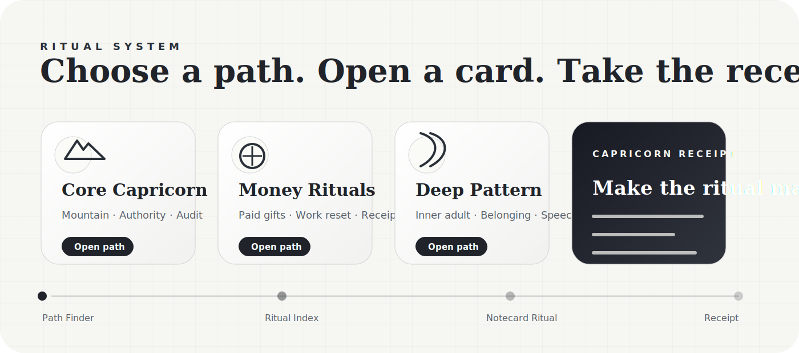

<p align="center">
  
</p>

# Moon Ritual Atlas

**A living ritual atlas for lunar experiences — beginning with the Full Moon in Capricorn.**

This is a mobile-first ritual product prototype: part moon guide, part ritual index, part notecard deck, part reflective tool. The current experience is built around the **Full Moon in Capricorn** and its themes of money, maturity, self-authority, ancestral patterns, and the adult self who can build.

<p>
  <a href="https://moon-ritual-atlas.vercel.app/"><strong>Open the live site →</strong></a>
</p>

> Source repo is private while the project is in active design/product iteration. The live Vercel deployment is public for mobile testing and review.

---

## Current experience

Moon Ritual Atlas currently includes one complete lunar experience:

### Full Moon in Capricorn Ritual Index

A guided ritual hub with:

- **Dawn / Dusk modes** for atmospheric viewing
- **Ritual Path Finder** for choosing the right practice
- **Ritual index cards** organized by theme
- **Guided notecard ritual pages** with step-by-step flow
- **Swipe navigation** across ritual steps
- **Copy / export / receipt flow** for saving notes and commitments
- **Soft motion pass** inspired by calm spiritual-tech product interfaces

<p align="center">
  
</p>

---

## Ritual inventory

The Capricorn experience includes all 11 rituals from the current build:

### Core Capricorn

- **The Mountain Ritual** — discipline, structure, long-term goals, and carrying the right burden
- **Authority Release Ritual** — shame, perfectionism, inner critic, fear of judgment, and authority wounds
- **Full Moon Audit** — a practical review of what is sustainable, what needs structure, and what must be released

### Money Rituals

- **Capricorn Money + Work Reset** — resource tracking, career clarity, and one grounded 30-day action
- **The Paid Gifts / Nine of Pentacles Ritual** — making money through actual gifts, visibility, paid form, and structure
- **The Capricorn Receipt** — the final material action that proves the ritual entered reality

### Deep Pattern / Shadow

- **The Inner Adult Who Can Be Paid** — family stories, self-authority, money, belonging, and waiting to be rescued
- **Clean Speech Vow** — rewriting wound-based money thoughts into clear adult language
- **Belonging Without Betrayal** — becoming visible without losing yourself

### Ancestral / Family

- **The Ancestral Backbone Ritual** — keeping inherited strength while releasing inherited suffering
- **Money Is No Longer Allowed to Mean…** — releasing old meanings attached to money, survival, punishment, shame, or abandonment

---

## Product direction

The long-term vision is a ritual atlas that can expand beyond one moon:

- Full moon experiences by sign
- New moon experiences
- Eclipse rituals
- Seasonal ritual collections
- Saved ritual paths
- Reflective tools and downloadable notes
- A deeper illustration/collage system inspired by antique field manuals and modern spiritual product design

The current site intentionally starts simple: one rich, complete Capricorn full moon experience, structured so it can grow later.

---

## Design notes

The working visual direction combines:

- **Modern ritual product UI**
- **Cool gray / black-white ritual notecards**
- **Dawn and Dusk atmosphere** instead of generic light/dark modes
- **Card-stack interaction** for ritual steps
- **Calm movement**: soft reveal, subtle swipe physics, gentle progress animation
- Future direction: collage pages, antique line-drawing object plates, ritual marginalia, and a Cancer ↔ Capricorn axis animation

---

## Tech

This is currently a static HTML prototype:

```text
index.html
README.md
assets/readme/
```

No build step is required right now.

---

## Local preview

Open the site locally:

```bash
open index.html
```

Or serve it locally:

```bash
python3 -m http.server 5173
```

Then open:

```text
http://localhost:5173
```

---

## Deploy

Live site:

```text
https://moon-ritual-atlas.vercel.app/
```

Deployment is handled through Vercel from the private GitHub repo.

Current setup:

- GitHub repo: `danielleackerman/moon-ritual-atlas`
- Default branch: `main`
- Vercel project: `moon-ritual-atlas`
- Framework preset: `Other`
- Build command: none
- Output directory: default / root

---

## Next planned passes

- Add hash-linked ritual routes, e.g. `#ritual/paid-gifts`
- Add localStorage fallback for notes, bookmarks, mode, and receipt fields
- Add accessibility polish: focus trap, Escape-to-close, visible focus states, reduced-motion checks
- Add full Ritual Atlas visual pass: collage layers, object plates, marginalia, antique line drawings
- Add a meaningful Cancer ↔ Capricorn axis animation

---

## Core line

> The child is heard.  
> The adult takes the keys.  
> The gift gets a doorway.  
> The ritual becomes material.
