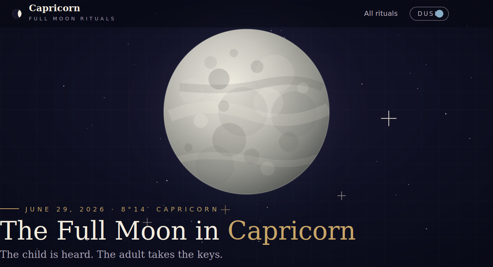
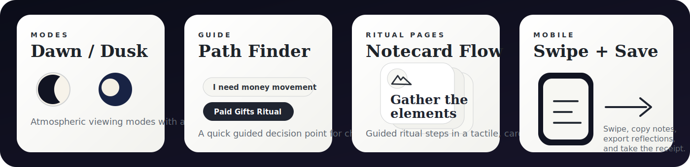

<p align="center">
  <a href="https://moon-ritual-atlas.vercel.app/">
    
  </a>
</p>

# Moon Ritual Atlas

**A future-facing lunar ritual atlas for full moons, new moons, eclipses, and seasonal thresholds.**

Moon Ritual Atlas is being built as a consumer-facing ritual experience: a mobile-first place to enter the lunar cycle through guided rituals, symbolic tools, reflective prompts, visually rich ritual pages, and grounded closing actions.

The goal is an expanding atlas of lunar moments — not a single page, not a one-off ritual, and not a generic moon blog. Each moon can become its own guided experience: a ritual index, a path finder, notecard-style ritual steps, reflective tools, and one material action that helps the ritual enter real life.

<p>
  <a href="https://moon-ritual-atlas.vercel.app/"><strong>Open the live atlas →</strong></a>
</p>

> The GitHub repo is private while the product is being designed and built. The Vercel site is public for mobile testing and review.

---

## What Moon Ritual Atlas is becoming

The atlas is designed to grow into a ritual library for lunar and seasonal work:

- **Full moon ritual indexes** by zodiac sign
- **New moon intention rituals** by sign and theme
- **Eclipse and threshold rituals** for heavier astrological portals
- **Seasonal ritual collections** tied to solstices, equinoxes, and turning points
- **Ritual Path Finder** experiences that recommend practices based on what the user is moving through
- **Guided notecard ritual pages** that feel tactile, focused, and mobile-friendly
- **Reflective tools** for writing, copying, exporting, and saving ritual notes
- **Material action prompts** that turn ritual into one grounded next step
- **Future visual system** with collage, antique object plates, ritual marginalia, moon imagery, and symbolic illustrations

The product direction is modern, alive, elegant, and practical — mystical without being cluttered, grounded without becoming dry.

<p align="center">
  
</p>

---

## Featured now: Full Moon in Capricorn

The first live room in the atlas is the **Full Moon in Capricorn Ritual Index**.

It is built around money, maturity, self-authority, ancestral patterns, structure, and the adult self who can build.

**Current live experience:**  
[https://moon-ritual-atlas.vercel.app/](https://moon-ritual-atlas.vercel.app/)

### What is live in the Capricorn page

- Dawn / Dusk modes
- Ritual Path Finder
- Ritual index cards organized by theme
- Guided notecard ritual pages
- Swipe navigation through ritual steps
- Copy / export / receipt flow
- Soft motion pass for main page and ritual cards
- Mobile-friendly static deployment through Vercel

---

## Current Capricorn ritual collection

The Capricorn experience includes 11 rituals:

### Core Capricorn

- **The Mountain Ritual** — discipline, structure, long-term goals, and carrying the right burden
- **Authority Release Ritual** — shame, perfectionism, inner critic, fear of judgment, and authority wounds
- **Full Moon Audit** — a practical review of what is sustainable, what needs structure, and what must be released

### Money Rituals

- **Capricorn Money + Work Reset** — resource tracking, career clarity, and one grounded 30-day action
- **The Paid Gifts / Nine of Pentacles Ritual** — making money through actual gifts, visibility, paid form, and structure
- **The Capricorn Receipt** — the final material action that proves the ritual entered reality

### Deep Pattern / Shadow

- **The Inner Adult Who Can Be Paid** — family stories, self-authority, money, belonging, and waiting to be rescued
- **Clean Speech Vow** — rewriting wound-based money thoughts into clear adult language
- **Belonging Without Betrayal** — becoming visible without losing yourself

### Ancestral / Family

- **The Ancestral Backbone Ritual** — keeping inherited strength while releasing inherited suffering
- **Money Is No Longer Allowed to Mean…** — releasing old meanings attached to money, survival, punishment, shame, or abandonment

---

## Design direction

The current Capricorn page is the first room in a larger atlas.

The visual direction is moving toward:

- modern ritual product UI
- Dawn and Dusk atmosphere instead of generic light/dark mode
- cool gray / black-white ritual notecard pages
- card-stack interaction for ritual steps
- calm movement inspired by spiritual-tech product interfaces
- future collage layers, object plates, marginalia, moon fragments, and antique line-drawing illustrations

---

## Roadmap

Planned next passes:

- Make rituals addressable with hash links, e.g. `#ritual/paid-gifts`
- Add localStorage fallback for notes, bookmarks, mode, and receipt fields
- Add accessibility polish: focus trap, Escape-to-close, visible focus states, reduced-motion checks
- Build the full Ritual Atlas visual layer: collage, object plates, field-manual details, and ritual marginalia
- Add a meaningful Cancer ↔ Capricorn axis interaction
- Expand from Capricorn into future full moon and new moon experiences

---

## Project notes

This is currently a static HTML prototype.

```text
index.html
README.md
assets/readme/
```

No build step is required right now.

Live deployment:

```text
https://moon-ritual-atlas.vercel.app/
```

Vercel setup:

- Project: `moon-ritual-atlas`
- Framework preset: `Other`
- Build command: none
- Output directory: default / root

---

## Core line

> The child is heard.  
> The adult takes the keys.  
> The gift gets a doorway.  
> The ritual becomes material.
